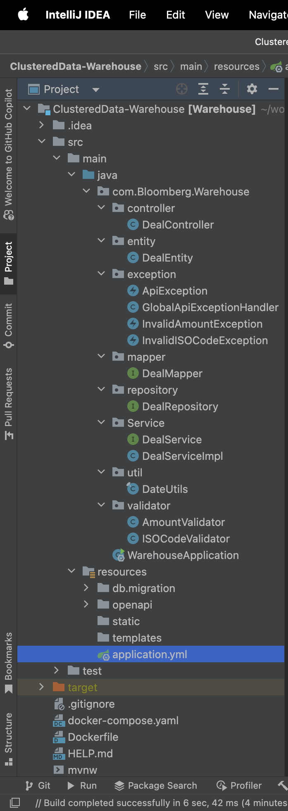
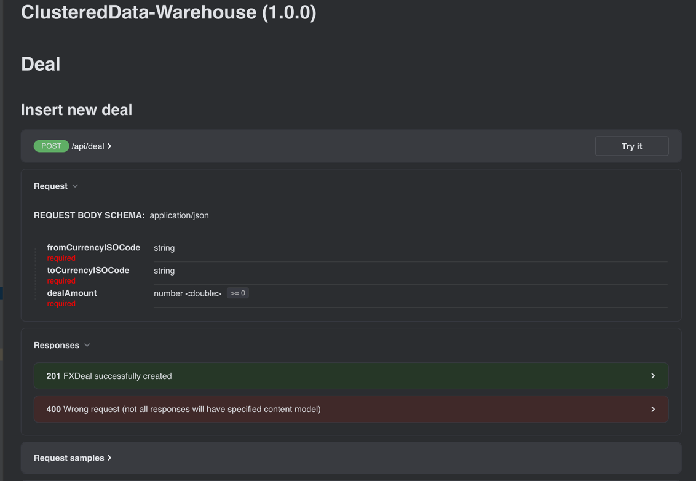
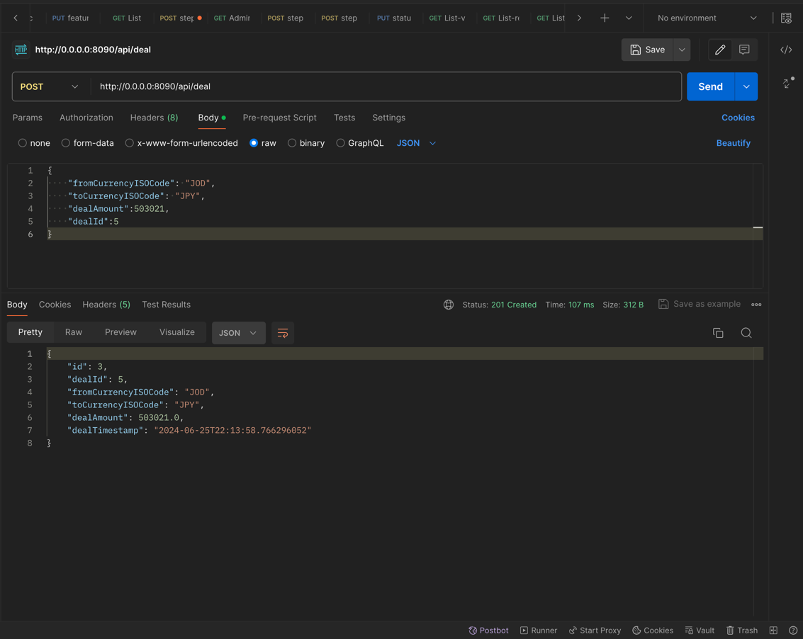

# ClusteredData-Warehouse
The ClusteredData-Warehouse project is designed to manage and analyze foreign exchange (FX) deals for Bloomberg. This system collects and stores detailed information about FX transactions, ensuring data integrity and facilitating comprehensive analysis.

## Overview
The Warehouse project is a Java-based application that utilizes the Spring Boot framework and Maven for dependency management. It also uses Postgres for data management. The project includes various validators to ensure the integrity of the data being

## Quickstart
1. Clone the repository
2. Open the project in your IDE: IntelliJ IDEA (recommended)
    * If you are using IntelliJ IDEA, make sure the IDE opens project as **Maven** and recognizes the project as a Spring Boot project .
3. Make sure you are in the `ClusteredData-Warehouse` directory
4. Configure the database connection in `application.properties` file (check the [Database](#database) section below for more info)
5. Run the project (by running the `main` method in `JtSpringProjectApplication.java`)
6. Open http://localhost:8080/ in your browser!

### Database

MySQL or MariaDB can be used as the database for this project. The database connection can be configured in the `application.properties` file, with the appropriate values for the following properties:
(you'd better use another username not root)
```properties
spring:
    datasource:
        driver-class-name: org.postgresql.Driver
        url: jdbc:postgresql://${DB_HOST:localhost}:${DB_PORT:5432}/${DB_NAME:fx}
        username: ${DB_USERNAME:fx}
jpa:
    database-platform: org.hibernate.dialect.PostgreSQLDialect
    hibernate:
        ddl-auto: none
```
# Workflow
- 
### Controller
   Post API is used to create a new deal. The controller validates the deal and sends it to the service layer.
### Service
The service layer validates the deal and sends it to the repository layer.
### Repository
The repository layer stores the deal in the database.
### Validator
The validator layer validates the deal before it is stored in the database.
### Model
The model layer defines the structure of the deal.
### Exception
The exception layer handles exceptions that occur during the validation process.
### DTO
The DTO layer defines the data transfer objects used to transfer data between the layers, and it's generated by openapi.yaml.

# API
- 
### Create Deal request
- 
# Docker
to run the project in docker you need to follow these steps:
1. Build the project using the following command:
```bash
mvn clean package
```
2. To start the Docker Compose services for the Clustered Data Warehouse project, use the following command:

```bash
docker-compose -f docker-compose.yaml -p your_project_name up -d
```
The project will be running on http://localhost:8000/

# Swagger
for more information about the API you can check the swagger documentation by visiting http://localhost:8080/swagger-ui.html

